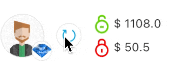

# AnimationController

## 


forward 正向  
reverse 反向  
repeat 重複動畫  
如果在 ..repeat\(reverse: true\) 則會正向動畫後 進行反向動畫, 再循環


## RotationTransition 旋轉動畫

```dart
import 'package:flutter/material.dart';
import 'package:flutter_redux/flutter_redux.dart';
import 'package:native_kit/config/constants.dart';
import 'package:native_kit/library/iconfont/icon_font.dart';
import 'package:native_kit/store/app_state.dart';
import 'package:native_kit/store/wallet/actions/index.dart';

class RefreshAmountViewModel {
  final bool isWalletAmountFetching;
  final VoidCallback onPressed;

  RefreshAmountViewModel({
    this.isWalletAmountFetching = false,
    required this.onPressed,
  });
}

class RefreshAmountButton extends StatefulWidget {
  @override
  _RefreshAmountButtonState createState() => _RefreshAmountButtonState();
}

class _RefreshAmountButtonState extends State<RefreshAmountButton> with TickerProviderStateMixin {

  late final AnimationController _controller;
  late final Animation<double> _animation;

  @override
  void dispose() {
    _controller.dispose();
    super.dispose();
  }

  @override
  void initState() {
    super.initState();

    _controller = AnimationController(
        duration: Duration(seconds: 1),
        vsync: this,
    )..repeat(reverse: false);

    _animation = CurvedAnimation(
      parent: _controller,
      curve: Curves.linear,
    );
  }


  @override
  Widget build(BuildContext context) {
    return StoreConnector<AppState, RefreshAmountViewModel>(
    onDidChange: (before, after) {
        // 判斷狀態控制動畫
        if(after.isWalletAmountFetching == true){
          _controller.repeat();
        }else{
          _controller.stop();

        }
    },
    converter: (store) {
      return RefreshAmountViewModel(isWalletAmountFetching: store.state.wallet.isWalletAmountFetching, onPressed: () => store.dispatch(FetchWalletAmountAction()));
    },
    builder: (BuildContext context, refreshAmountViewModel) {
      var isFetching = refreshAmountViewModel.isWalletAmountFetching;
      var onPressed = refreshAmountViewModel.onPressed;

      return Container(
        width: 30,
        height: 30,
        clipBehavior: Clip.hardEdge,
        decoration: BoxDecoration(
          color: Colors.white,
          border: Border.all(color: kGreyColor1),
          borderRadius: BorderRadius.circular(99),
        ),
    

        child: RotationTransition(
          turns: _animation,
          child: Opacity(
            opacity: isFetching ? .5: 1,
            child: TextButton(
              child: Icon(IconFont.redo, color: kPrimaryColor, size: 20),
              style: TextButton.styleFrom(padding: EdgeInsets.all(4), primary: kGreyColor),
              onPressed: isFetching ? null : onPressed,
            ),
          )

        ),
       
      );
    });

  }

}

```



