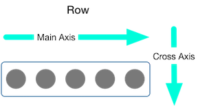

# Column, Row

該 Widget 相等於 Web flex-direction column, Row

### Column


### 使用方式

```dart
Column(
  mainAxisAlignment: MainAxisAlignment.center,
  mainAxisSize: MainAxisSize.min,
  children: [
    Text('上'),
    Text('下'),
  ],
),
```


如果你單純是列表項目, 請使用 ListView  
如果你是列表項目, 並且非常多, 請使用 ListView.builder


### Row 



### 使用方式

```dart
Row(
  mainAxisAlignment: MainAxisAlignment.center,
  mainAxisSize: MainAxisSize.min,
  children: [
    Text('左'),
    Text('右'),
  ],
),
```

