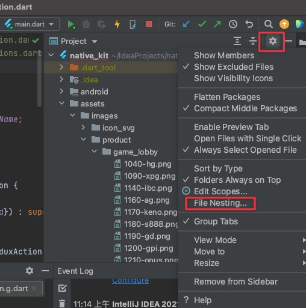
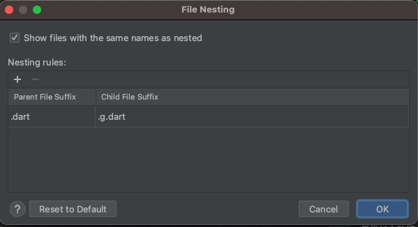
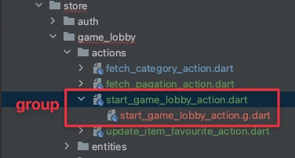
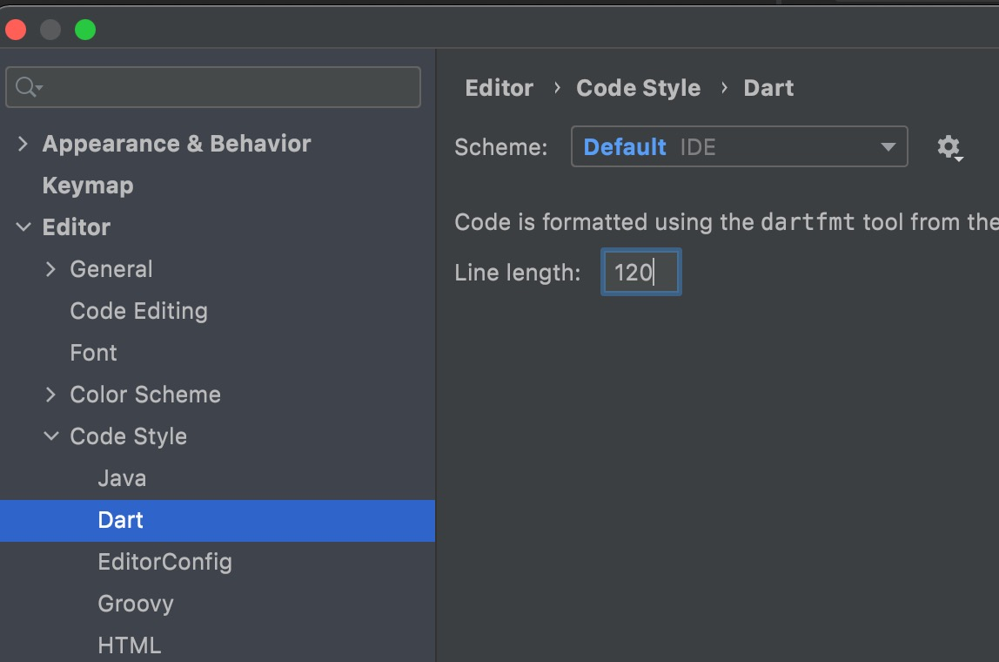

# Builder Model \(json & map\)

### Setting

in `./build.yaml`

### How to use

1. run command

   ```text
   $ flutter pub run build_runner watch --delete-conflicting-outputs
   ```

2. open [json2dart-model ](https://imagine10255.github.io/json2dart-model/)website
3.  copy your json string

```dart
import 'package:json_annotation/json_annotation.dart'; // <~ this
import 'package:copy_with_extension/copy_with_extension.dart'; // <~ this

part 'state.g.dart'; // <~ this

@JsonSerializable() // <~ this
@CopyWith() // <~ add this
class System {
  System({
    this.isFetching = false,
  });

  bool? isFetching;
 
  /// JsonSerializable Build
  factory System.fromJson(Map<String, dynamic> json) => _$SystemFromJson(json); // <~ add this
  Map<String, dynamic> toJson() => _$SystemToJson(this); // <~ add this
}
```


if you need use one, run commend

```bash
# 更新
$ flutter pub run build_runner build

# 刪除重建
$ flutter pub run build_runner build --delete-conflicting-outputs
```


## 調整IDEA做目錄GROUP






```dart

```



### 問題

```dart
Unhandled exception:
Bad state: Unable to generate package graph, no `/Users/garychien/Documents/project/flutter-native-kit/.dart_tool/flutter_gen/pubspec.yaml` found.
#0      _pubspecForPath (package:build_runner_core/src/package_graph/package_graph.dart:232:5)
#1      _parsePackageDependencies (package:build_runner_core/src/package_graph/package_graph.dart:206:21)
#2      PackageGraph.forPath (package:build_runner_core/src/package_graph/package_graph.dart:101:33)
<asynchronous suspension>
#3      main (file:///Users/garychien/Documents/project/flutter/.pub-cache/hosted/pub.dartlang.org/build_runner-2.0.5/bin/build_runner.dart:27:30)
<asynchronous suspension>
pub finished with exit code 255
```

```dart
flutter clean
flutter packages pub get
```

### 這邊的設定會影響格式化排版



