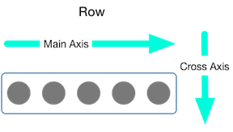

# Column, Row


## Column


### 使用方法

```dart
Column(
  mainAxisAlignment: MainAxisAlignment.center,
  crossAxisAlignment: CrossAxisAlignment.start,
  mainAxisSize: MainAxisSize.min,
  children: [
    Text('上'),
    Text('下'),
  ],
),
```


如果你單純是列表項目, 請使用 ListView  
如果你是列表項目, 並且非常多, 請使用 ListView.builder  
如果你是畫面超出, 請使用 [SingleChildScrollView](single-child-scroll-view.md)



### 屬性

| Class | Name | Desc | Default |
| :--- | :--- | :--- | :--- |
| [MainAxisAlignment](../attribute-class/main-axis-alignment.md) | mainAxisAlignment | 垂直對齊方式 |  |
| [CrossAxisAlignment](../attribute-class/cross-axis-alignment.md) | crossAxisAlignment | 水平對齊方式 |  |
| [MainAxisSize](../attribute-class/main-axis-size.md) | mainAxisSize |  |  |
| Widget | child | 內容 |  |

## Row 



### 使用方法

```dart
Row(
  mainAxisAlignment: MainAxisAlignment.center,
  mainAxisSize: MainAxisSize.min,
  children: [
    Text('左'),
    Text('右'),
  ],
),
```

### 屬性

| Class | Name | Desc | Default |
| :--- | :--- | :--- | :--- |
| [MainAxisAlignment](../attribute-class/main-axis-alignment.md) | mainAxisAlignment | 水平對齊方式 |  |
| [CrossAxisAlignment](../attribute-class/cross-axis-alignment.md) | crossAxisAlignment | 垂直對齊方式 |  |
| [MainAxisSize](../attribute-class/main-axis-size.md) | mainAxisSize |  |  |
| Widget | child | 內容 |  |

## 

